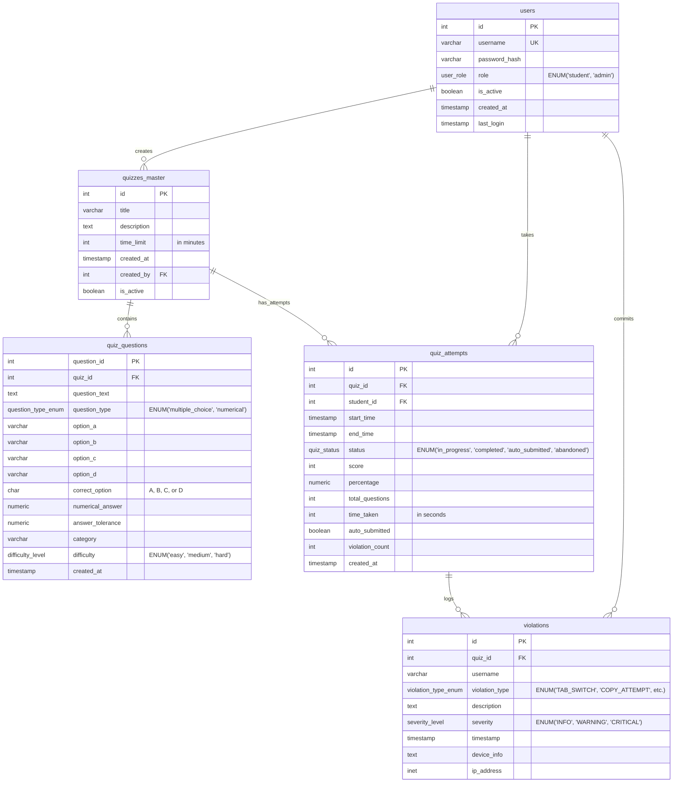

## Database Schema Overview

### Key Relationships:
- **Users** create **Quizzes Master** (Admin role)
- **Users** take **Quiz Attempts** (Student role)
- **Quizzes Master** contains **Quiz Questions** (1-to-many)
- **Quizzes Master** has **Quiz Attempts** (1-to-many)
- **Quiz Attempts** logs **Violations** (1-to-many)
- **Users** commit **Violations** during quiz attempts

### Custom ENUM Types:
- `user_role`: student, admin
- `question_type_enum`: multiple_choice, numerical
- `difficulty_level`: easy, medium, hard
- `quiz_status`: in_progress, completed, auto_submitted, abandoned
- `violation_type_enum`: TAB_SWITCH, COPY_ATTEMPT, PASTE_ATTEMPT, SCREENSHOT_ATTEMPT, CONTEXT_MENU, KEYBOARD_SHORTCUT, MULTIPLE_TABS, SUSPICIOUS_BEHAVIOR
- `severity_level`: INFO, WARNING, CRITICAL