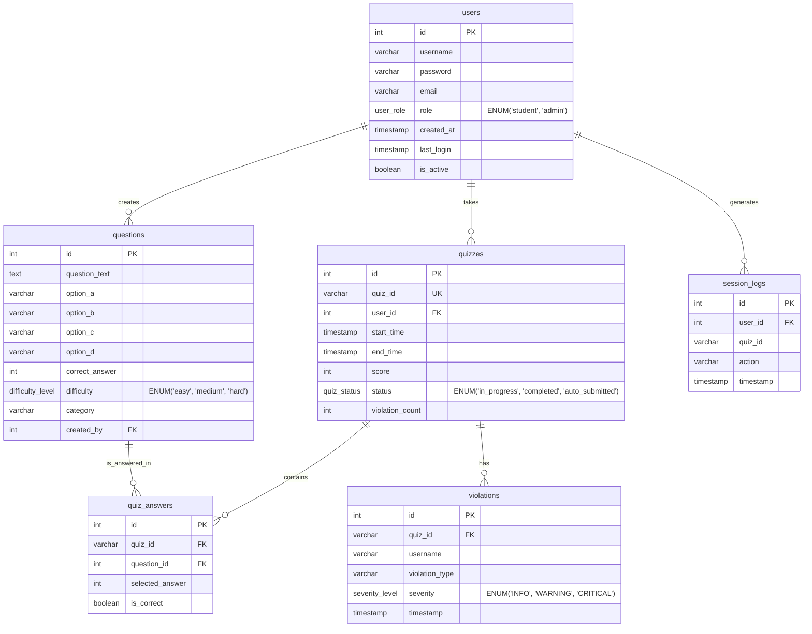

```mermaid
erDiagram
    users {
        int id PK
        varchar username
        varchar password
        varchar email
        user_role role "ENUM('student', 'admin')"
        timestamp created_at
        timestamp last_login
        boolean is_active
    }

    questions {
        int id PK
        text question_text
        varchar option_a
        varchar option_b
        varchar option_c
        varchar option_d
        int correct_answer
        difficulty_level difficulty "ENUM('easy', 'medium', 'hard')"
        varchar category
        int created_by FK
    }

    quizzes {
        int id PK
        varchar quiz_id UK
        int user_id FK
        timestamp start_time
        timestamp end_time
        int score
        quiz_status status "ENUM('in_progress', 'completed', 'auto_submitted')"
        int violation_count
    }

    quiz_answers {
        int id PK
        varchar quiz_id FK
        int question_id FK
        int selected_answer
        boolean is_correct
    }

    violations {
        int id PK
        varchar quiz_id FK
        varchar username
        varchar violation_type
        severity_level severity "ENUM('INFO', 'WARNING', 'CRITICAL')"
        timestamp timestamp
    }

    session_logs {
        int id PK
        int user_id FK
        varchar quiz_id
        varchar action
        timestamp timestamp
    }

    users ||--o{ quizzes : "takes"
    users ||--o{ questions : "creates"
    users ||--o{ session_logs : "generates"
    
    quizzes ||--o{ quiz_answers : "contains"
    quizzes ||--o{ violations : "has"
    
    questions ||--o{ quiz_answers : "is_answered_in"

```
