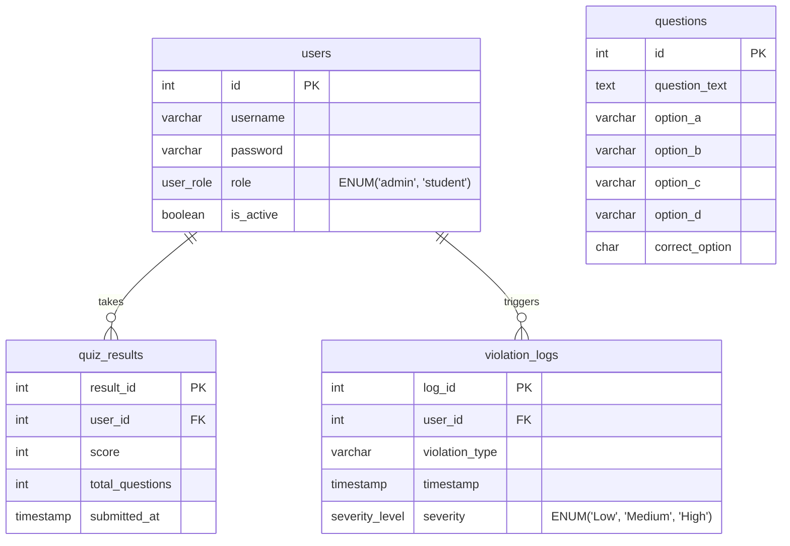

```mermaid
erDiagram
    users {
        int id PK
        varchar username
        varchar password
        user_role role "ENUM('admin', 'student')"
        boolean is_active
    }

    questions {
        int id PK
        text question_text
        varchar option_a
        varchar option_b
        varchar option_c
        varchar option_d
        char correct_option
    }

    quiz_results {
        int result_id PK
        int user_id FK
        int score
        int total_questions
        timestamp submitted_at
    }

    violation_logs {
        int log_id PK
        int user_id FK
        varchar violation_type
        timestamp timestamp
        severity_level severity "ENUM('Low', 'Medium', 'High')"
    }

    users ||--o{ quiz_results : "takes"
    users ||--o{ violation_logs : "triggers"
```
