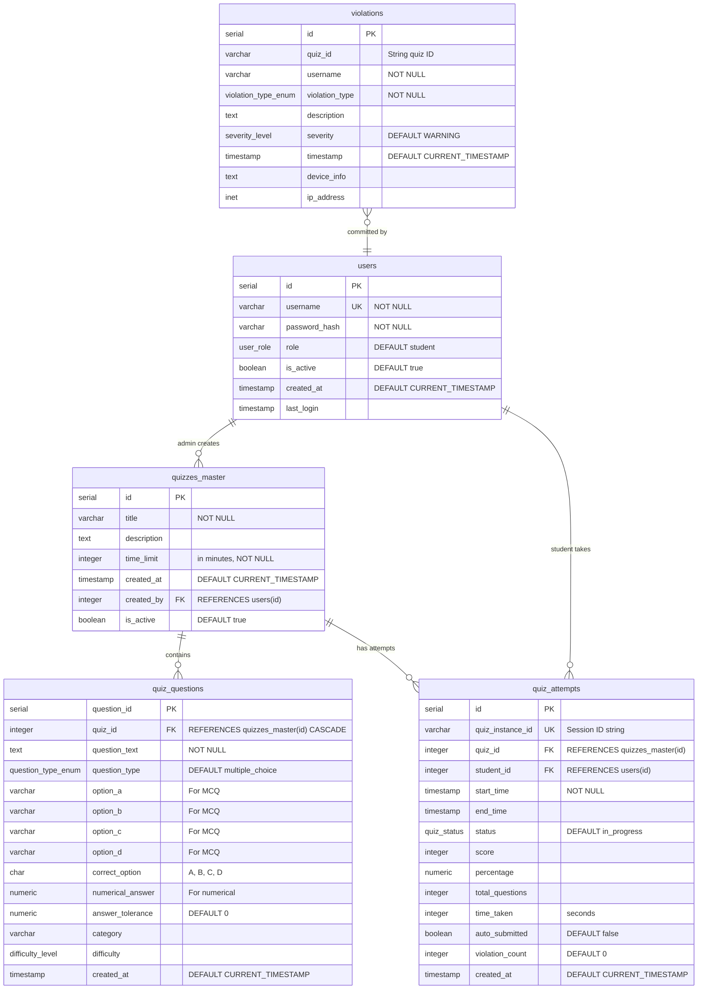

# Anti-Malpractice Quiz System - ER Diagram

## Entity Relationship Diagram



## Database Schema Overview

### Tables Summary

| Table | Primary Key | Description |
|-------|-------------|-------------|
| **users** | id (serial) | Student and admin accounts |
| **quizzes_master** | id (serial) | Quiz templates created by admins |
| **quiz_questions** | question_id (serial) | Questions (MCQ/numerical) for quizzes |
| **quiz_attempts** | id (serial) | Student quiz sessions with results |
| **violations** | id (serial) | Malpractice incidents during quizzes |

### Key Relationships

1. **Users → Quizzes Master** (1-to-many)
   - Admin users create quiz templates
   - Foreign key: `quizzes_master.created_by` → `users.id`

2. **Users → Quiz Attempts** (1-to-many)
   - Student users take quizzes
   - Foreign key: `quiz_attempts.student_id` → `users.id`

3. **Quizzes Master → Quiz Questions** (1-to-many, CASCADE DELETE)
   - Each quiz contains multiple questions
   - Foreign key: `quiz_questions.quiz_id` → `quizzes_master.id`
   - **CASCADE DELETE**: Deleting quiz removes all questions

4. **Quizzes Master → Quiz Attempts** (1-to-many)
   - Track all student attempts for each quiz
   - Foreign key: `quiz_attempts.quiz_id` → `quizzes_master.id`

5. **Users ← Violations** (many-to-1)
   - Violations linked to users via username
   - Relationship: `violations.username` references `users.username`

### Important Schema Features

#### Variable Data Types
- **quiz_attempts.quiz_instance_id** (VARCHAR): Session-based string ID
  - Example: `"QUIZ-1761796705275"`
  - Unique identifier for each quiz session
  
- **violations.quiz_id** (VARCHAR): String-based quiz reference
  - Supports flexible quiz ID formats
  - Allows non-integer identifiers

#### Dual Question Types
**Multiple Choice Questions (MCQ):**
- Uses: `option_a`, `option_b`, `option_c`, `option_d`
- Answer: `correct_option` (A, B, C, or D)

**Numerical Questions:**
- Uses: `numerical_answer`
- Tolerance: `answer_tolerance` for acceptable error margin

### Custom ENUM Types

| ENUM Type | Values | Usage |
|-----------|--------|-------|
| **user_role** | `student`, `admin` | User account types |
| **question_type_enum** | `multiple_choice`, `numerical` | Question formats |
| **difficulty_level** | `easy`, `medium`, `hard` | Question difficulty |
| **quiz_status** | `in_progress`, `completed`, `auto_submitted`, `abandoned` | Quiz attempt states |
| **violation_type_enum** | `TAB_SWITCH`, `COPY_ATTEMPT`, `PASTE_ATTEMPT`, `SCREENSHOT_ATTEMPT`, `CONTEXT_MENU`, `KEYBOARD_SHORTCUT`, `MULTIPLE_TABS`, `SUSPICIOUS_BEHAVIOR`, `AUTO_SUBMIT` | Malpractice types |
| **severity_level** | `INFO`, `WARNING`, `CRITICAL` | Violation severity |

### Performance Indexes

```sql
-- User lookups
CREATE INDEX idx_users_username ON users(username);
CREATE INDEX idx_users_role ON users(role);

-- Quiz relationships
CREATE INDEX idx_quiz_questions_quiz_id ON quiz_questions(quiz_id);
CREATE INDEX idx_quiz_attempts_student_id ON quiz_attempts(student_id);
CREATE INDEX idx_quiz_attempts_quiz_id ON quiz_attempts(quiz_id);
CREATE INDEX idx_quiz_attempts_status ON quiz_attempts(status);

-- Violation tracking
CREATE INDEX idx_violations_username ON violations(username);
CREATE INDEX idx_violations_quiz_id ON violations(quiz_id);
CREATE INDEX idx_violations_timestamp ON violations(timestamp);
```

### Sample Data Included

**Users:**
- 1 admin: `admin` / `admin123`
- 4 students: `student1`, `student2`, `john_doe`, `jane_smith`

**Quiz:**
- "Sample Math Quiz" - 30 minutes
- 3 MCQ questions (easy-medium)
- 3 Numerical questions (easy-medium)

## Database Operations

### Quiz Creation Workflow
1. Admin creates empty quiz in `quizzes_master`
2. Admin adds questions to `quiz_questions` (linked by `quiz_id`)
3. Students view available quizzes
4. Students take quiz → creates `quiz_attempts` record
5. System logs violations during quiz → `violations` table

### Cascade Deletion
When a quiz is deleted from `quizzes_master`:
- ✅ All related `quiz_questions` are automatically deleted (CASCADE)
- ⚠️ Manual deletion required for `quiz_attempts` and `violations`

### Auto-Submission
When violations reach threshold (default: 5):
- Quiz is auto-submitted
- `quiz_attempts.auto_submitted` = true
- `quiz_attempts.status` = 'auto_submitted'
- Violation added with type `AUTO_SUBMIT`

---

**Version:** 2.0  
**Last Updated:** October 30, 2025  
**Database:** PostgreSQL 17.5
